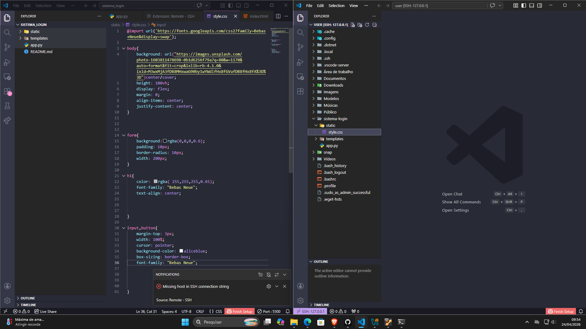

# Relatorio do "sistema-login"

### app.py 

    Lógica e Servidor (Flask/Python)
    Desenvolvi o "motor" do sistema em Flask, criando as rotas de acesso e a lógica de autenticação. O servidor captura os dados e valida se o usuário e senha correspondem aos valores definidos; em caso positivo, o acesso é liberado. O sistema roda na porta 8000 para 
    testes locais.

### index.html
    Aqui fazemos o html, que a linguagem de marcação que utilizamos para as construção do site

### style.css

    Aqui fizemos a estilização do site

 

 
-----------------------------------------------------------------

# Acima esta a programação do site abaixo esta o relatorio passo a passo de conexão de redes

## 🛠️ Passo 1: Configuração da Rede (Port Forwarding)
    Para permitir que o Windows se comunique com a VM, foi configurado o redirecionamento de portas (Port Forwarding):

    Nome: ssh

    IP do Host: 127.0.0.1 (localhost)

    Porta do Host: 2222

    Porta do Convidado (VM): 22

## 🐧 Passo 2: Preparação do SSH no Ubuntu
    Dentro do Ubuntu, garantimos que o serviço SSH estivesse ativo e atualizado:

## Aqui baixei e verifiquei se o ssh estava na minha máquina com os codigos

### Atualizar os daemons do sistema
    sudo systemctl daemon-reload

### Iniciar o serviço SSH
    sudo systemctl start ssh

### Verificar se o serviço está rodando corretamente
    sudo systemctl status ssh

### No linux
    No vs code da vm colocamos isto, para acessar a pasta no ubunto.

## 💻 Passo 3: Acesso Remoto via Windows
    Via Terminal (CMD/PowerShell)
    Para testar a conexão inicial:

    ssh -p 2222 user@127.0.0.1

    no VS iremos fazer:
    Via VS Code (Remote SSH)
    Pressione Ctrl + Shift + P e selecione Remote-SSH: Add New SSH Host....

    Insira o comando de conexão: ssh -p 2222 user@127.0.0.1.

    Selecione o arquivo de configuração e conecte-se ao "Linux".

    Insira a senha do usuário quando solicitado.

## 📂 Passo 4: Transferência de Arquivos (Desafio)
    Com a conexão estabelecida no VS Code, o desafio de mover a pasta do Sistema de Login foi resolvido de forma intuitiva:

    Abrimos o explorador de arquivos remoto no VS Code.

    Arrastamos a pasta do ambiente Windows diretamente para o diretório de destino no Ubuntu.

    O VS Code realizou a cópia automática dos arquivos entre os sistemas.

## Passo 4.2: Acesso remoto (Desafio)
    
    Aqui nós tinhamos que acessar o computador do outro pelo vs code neste caso meu amigo acessou o meu, aqui nós tivemos que muda o modo da placa de rede de NAT para modo bridge, assim possibilitando o acesso de outras maquinas. Após isso mudei o acesso da porta no ubuntu para 22, depois fizemos o msm processo para acessar, o ssh no vs code, passei o usuario e a senha e o meu amigo conseguiu acessar 

## 🚀 Passo 5: Execução do Sistema Flask
    Com os arquivos no Ubuntu, preparamos o ambiente para rodar o servidor:

    Instalação das dependências:

    Bash
    pip install flask
    Inicialização do sistema:
    Navegamos até a pasta do projeto e executamos o script principal (ex: python app.py).

    Acesso:
    O site foi acessado através do navegador no host pelo endereço:
    http://localhost:8000

